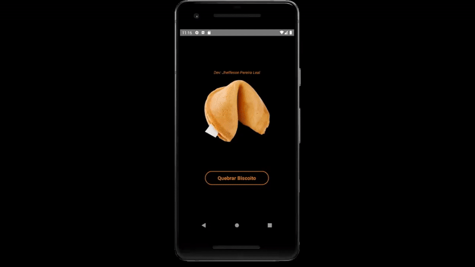

# 🍪 App Biscoito da Sorte
Projeto desenvolvido durante as aulas de React Native com orientação do professor Matheus Fraga.

## 🎯 Sobre o Projeto
App que exibe frases motivacionais aleatórias ao "quebrar" um biscoito virtual.

## 🎯 Demonstração

## 👨‍💻 Desenvolvimento
- **Aluno**: Jheffeson Pereira Leal
- **Orientação**: Professor Matheus Fraga
- **Instituição**: [UDEMY - React Native Criando aplicativos do zero ao avançado]

## 🛠️ Tecnologias
- **React Native** - Framework mobile
- **Componentes Nativos** - View, Text, TouchableOpacity, Image
- **StyleSheet** - Estilização componentizada
- **Hooks** - Gerenciamento de estado com setState

## Como Testar Este Projeto

# Clone o repositório
git clone https://github.com/jheffeson/app-biscoito-da-sorte.git
# Instale as dependências
npm install
# Execute no Android
npx react-native run-android
# Ou no iOS
npx react-native run-ios
